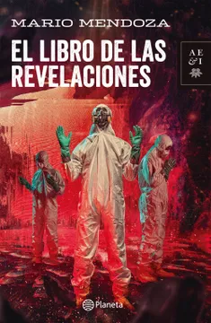
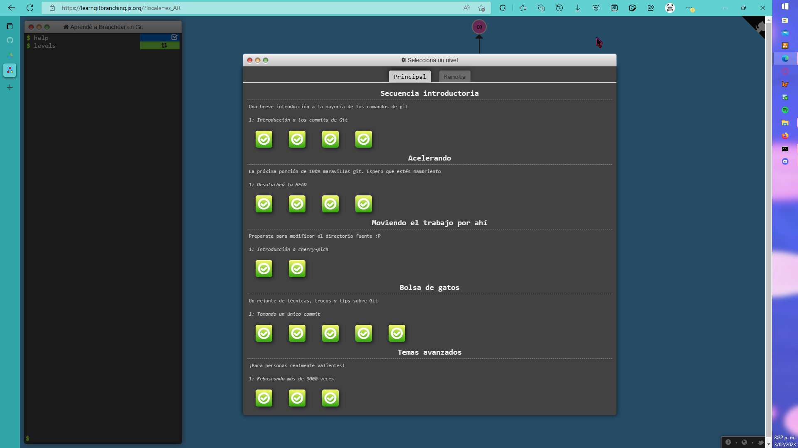
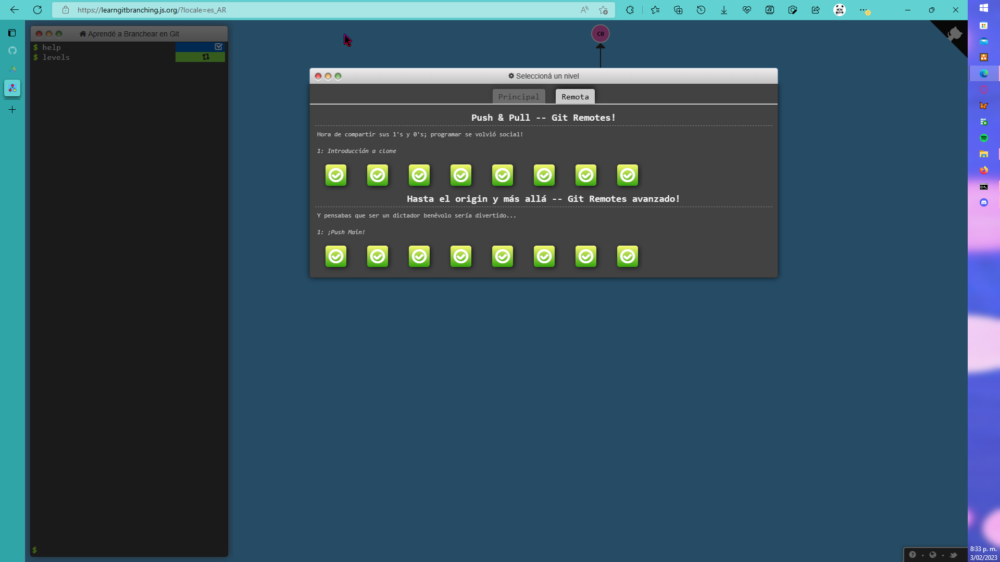

# CVDS -LAB1

## Información básica 

Mi nombre es Santiago Naranjo Melo, tengo 19  años, mi cumpleaños es el **1 de abril**. Vivo en Bogotá-Suba,  estoy estudiando ingenieria de sistemas en la universidad [Escuela Colombiana de Ingenieria Julio Garavito](https://www.escuelaing.edu.co/es/) (ECI), el recorrido para ir de mi casa a la universidad es muy tedioso pues me demoro dos horas por el tráfico que hay en Bogotá, por lo general, mi medio de transporte para ir a la ECI es ir en transmilenio. Me gusta leer, dibujar, jugar video Juegos. Tambien estoy estudiando ingles en la academia [Smart](https://smart.edu.co/?utm_source=Google&utm_medium=Search&gclid=CjwKCAiA_vKeBhAdEiwAFb_nrVvXnvAsk90gRaqA6-eHGuJ_Ho_WtPLg5EtIQUQl4D5f1T4gyZ77ABoCBIEQAvD_BwE).

## Asignaturas que  actualmente me encuentro cursando
1. FCFI (Fundamentos Finacieros y Contables)
2. CLYS (Cine, Literatura y Sociedad)
3. RECO (Redes de Computadores)
4. TPRO (Teoria de la Programación)
5. CVDS (Ciclos de Vida del Desarrollo de Software)

## Mis Libros favoritos
- El libro de las revelaciones (*Mario Mendoza*)
- Ensayo sobre la ceguera (*José Saramago*)
- Expedientes X Colombia (*Esteban Cruz Niño*)
- Un capitan de quince años (*Julio Verne*)

		public class  Frases{ 
 	  		public static void main(String args[]) {
 				system.out.printIn("Leer es resistir");
 				system.out.printIn("Sueño con mis ojos abiertos.");
   		 	}
		}

  

## Git Branching

Ejercicios Main\
Santiago Naranjo Melo\
Carnet: 1000046235

Ejercicios Remote\
Santiago Naranjo Melo\
Carnet: 1000046235\

